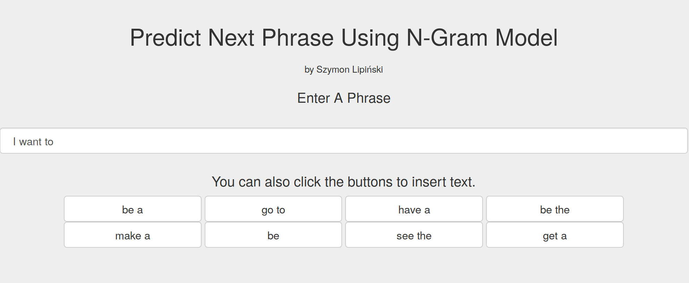

N-Gram Based Next Phrase Prediction
========================================================
author: Szymon Lipiński
date: 2019-11-09
autosize: true

The App
========================================================
* The application allows to enter text. 
* The proposed phrases appear on the buttons. 
* User can click on the button to add the phrase to the entered text.

The Algorithm
========================================================
* There is used a data file containig 4M of most common trigrams from the input files.
* If no word has been entered - the algorithm presents the most common first words in trigrams.
* If there is one word - then it's used to predict the next two words from the trigrams, and it's combined with the no-word list.
* In case of two or more words: 
  * the last two are used to predict the next one
  * the last is used to predict the next two
  * a list of most common first words is used
  * all three above lists are combined

Metrics
========================================================

* The average response time is below 2s.

* The top memory usage is 300MB, it depends on the size of the data file.

* The data file has 97MB, it can be stripped down with decreaseing accuracy and better response time.

* The data file contains 4M of the most common trigrams.

Links
========================================================

* The application is available at:
https://szymonlipinski.shinyapps.io/NGramApp/

* The code for all the files for this project is at
https://github.com/szymonlipinski/DataScienceCapstone
